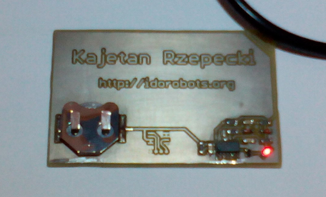

# Business Detector
A business card with a little mains AC voltage detector - proof of concept. Here's an early prototype PCB:

**Cons:**
- It's quite expensive for a business card.
- The battery socket makes the whole thing slightly thick.
- If you present it to pretty much anybody, they go straight to the nearest mains plug socket.

**Pros:**
- If you present it to somebody and they get electrocuted, you probably don't want to do business with them anyway. Bullet dodged.
